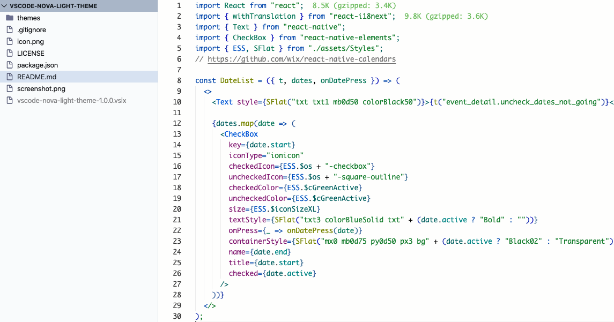
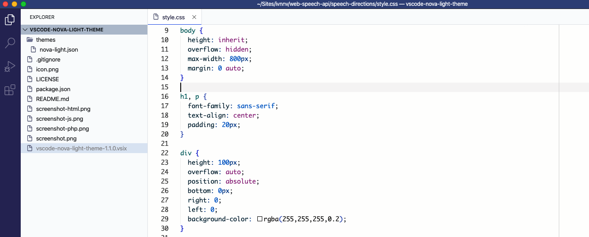

# Nova Light Theme

A full [VSCode](https://code.visualstudio.com/) light theme inspired by `Visual Studio`, `Komodo Edit` and `Github`.
Mainly used and customized for frontend development (HTML, CSS, Javascript and PHP), but other languages are also supported as it's based on the [Github Plus theme](https://github.com/thenikso/github-plus-theme).

## Vanilla JS

## PHP

## HTML

## CSS

Use [GitHub issues](https://github.com/ivnnv/vscode-nova-light-theme) to report problems/requests
