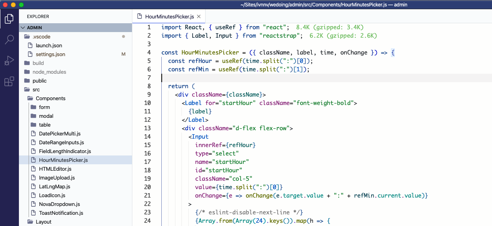
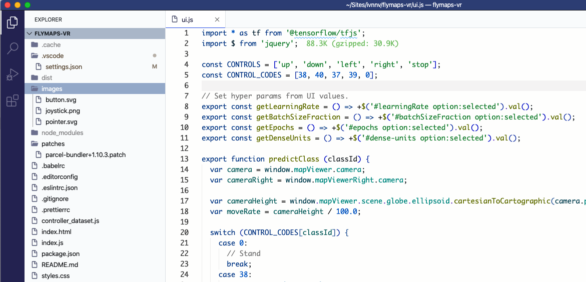
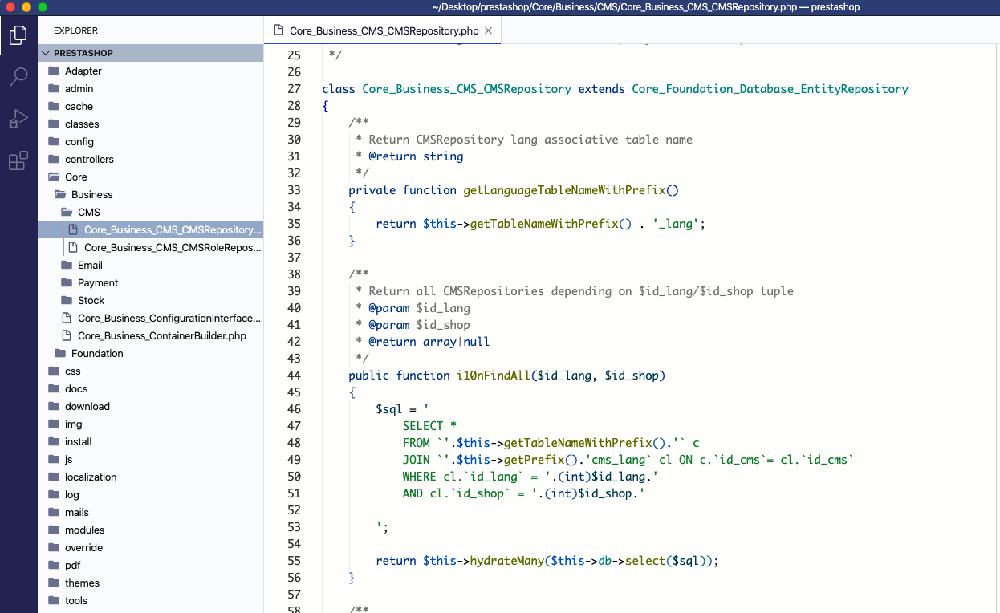
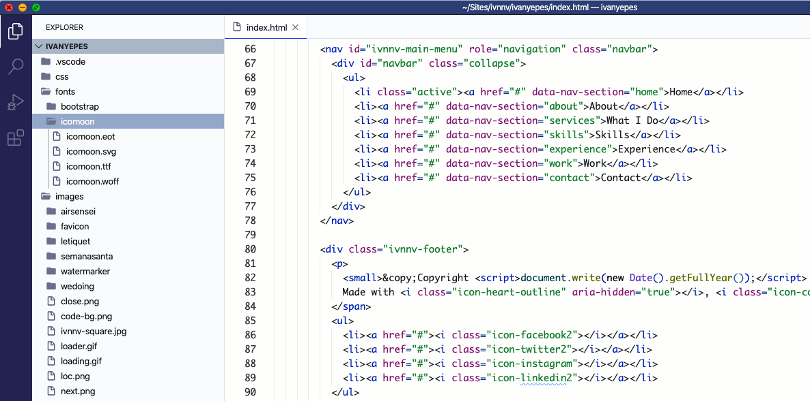
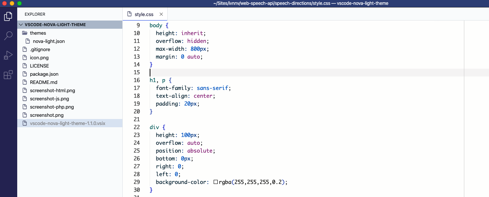
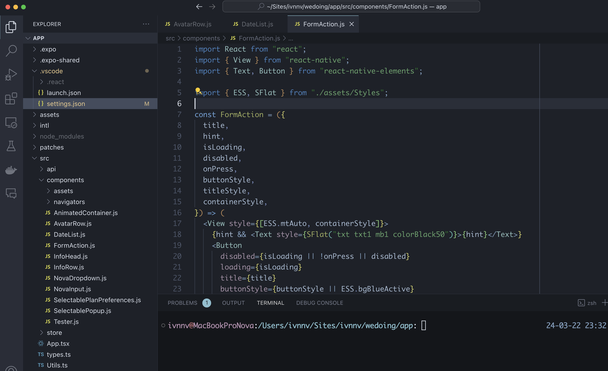

# Nova Light Theme

A set of light and dark [VSCode](https://code.visualstudio.com/) themes inspired by previously used IDEs.
Mainly used and customized for frontend development (HTML, CSS, Javascript and PHP), but other languages are also supported as they are based on [Github Plus theme](https://github.com/thenikso/github-plus-theme) (light) and [Nord Deep](https://github.com/marlosirapuan/vscode-theme-nord-deep).

# Light Theme

### Vanilla JS

### PHP

### HTML

### CSS

# Dark Theme

Use [GitHub issues](https://github.com/ivnnv/vscode-nova-themes) to report problems/requests
